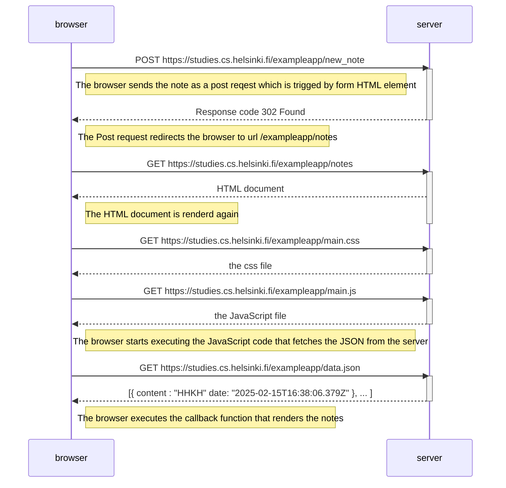

```mermaid
    sequenceDiagram
        participant browser
        participant server


        browser->>server: POST  https://studies.cs.helsinki.fi/exampleapp/new_note
        activate server
        Note right of browser: The browser sends the note as a post reqest which is trigged by form HTML element
        server-->>browser: Response code 302 Found
        deactivate server   

        Note right of browser: The Post request redirects the browser to url /exampleapp/notes

        browser->>server: GET https://studies.cs.helsinki.fi/exampleapp/notes
        activate server
        server-->>browser: HTML document
         Note right of browser: The HTML document is renderd again
        deactivate server

        browser->>server: GET https://studies.cs.helsinki.fi/exampleapp/main.css
        activate server
        server-->>browser: the css file
        deactivate server

        browser->>server: GET https://studies.cs.helsinki.fi/exampleapp/main.js
        activate server
        server-->>browser: the JavaScript file
        deactivate server

        Note right of browser: The browser starts executing the JavaScript code that fetches the JSON from the server

        browser->>server: GET https://studies.cs.helsinki.fi/exampleapp/data.json
        activate server
        server-->>browser: [{ content : "HHKH" date: "2025-02-15T16:38:06.379Z" }, ... ]
        deactivate server

        Note right of browser: The browser executes the callback function that renders the notes
```